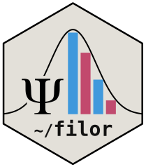

<!-- README.md is generated from README.Rmd. Please edit that file -->



```{r, include = FALSE}
knitr::opts_chunk$set(
  collapse = TRUE,
  comment = "#>",
  fig.path = "man/figures/README-",
  out.width = "100%"
)
```

# filor

<!-- badges: start -->
<!-- badges: end -->

## Installation

You can install the development version of filor from [GitHub](https://github.com/) with:

``` r
# install.packages("devtools")
devtools::install_github("filippogambarota/filor")
```
